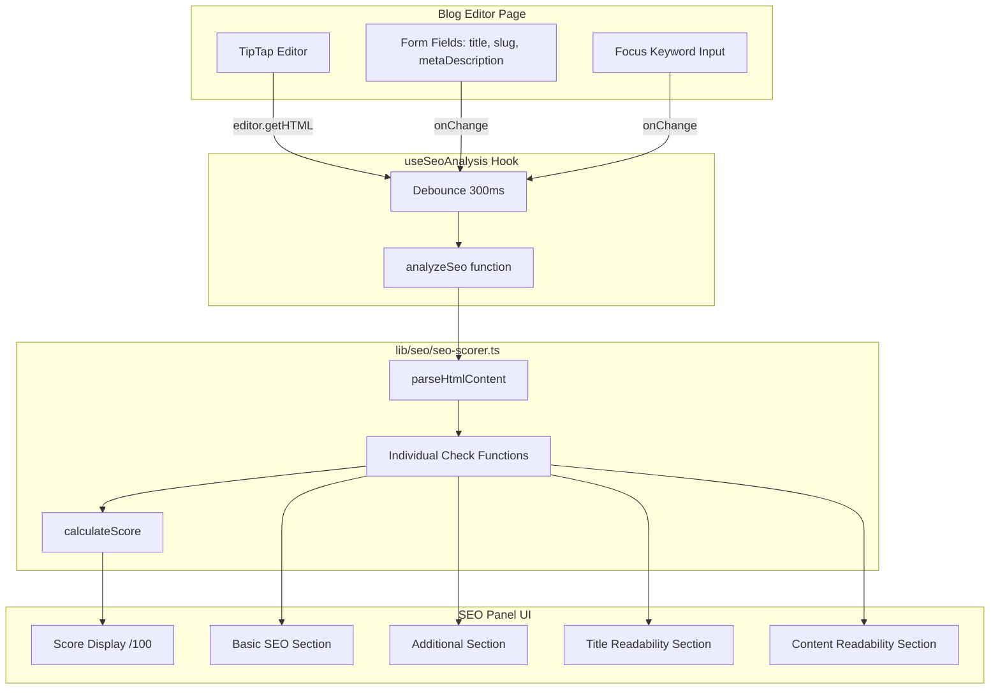
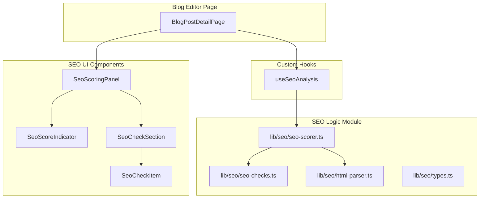

# Design Document: Blog SEO Scoring

## Overview

Tài liệu thiết kế kỹ thuật cho hệ thống chấm điểm SEO real-time trong blog editor của DukyStore Dashboard. Hệ thống phân tích nội dung bài viết dựa trên focus keyword và cho điểm theo các tiêu chí chuẩn SEO (tương tự Rank Math SEO / Yoast SEO). Toàn bộ phân tích chạy client-side, cập nhật real-time khi user thay đổi nội dung.

### Quyết định thiết kế chính

- **Pure functions cho logic phân tích**: Tách toàn bộ logic SEO scoring thành các pure functions trong module riêng (`lib/seo/seo-scorer.ts`) — dễ test, dễ tái sử dụng, không phụ thuộc vào React state.
- **Custom hook `useSeoAnalysis`**: Wrap logic scoring với debounce 300ms và React state — tách biệt UI khỏi business logic.
- **HTML parsing bằng DOMParser**: Sử dụng browser-native DOMParser để parse HTML từ TipTap editor — không cần thêm dependency, hiệu suất cao.
- **Tích hợp vào section "Rank Math SEO" hiện tại**: Không tạo panel mới mà mở rộng section đã có — giữ UX nhất quán.
- **Weighted scoring system**: Mỗi tiêu chí có trọng số riêng, điểm tổng = tổng trọng số các tiêu chí pass — linh hoạt điều chỉnh tầm quan trọng.

## Architecture

### Tổng quan luồng dữ liệu



### Component Architecture



## Components and Interfaces


### 1. Types Module (`lib/seo/types.ts`)

```typescript
/** Kết quả của một tiêu chí SEO */
export interface SeoCheckResult {
  id: string
  label: string
  passed: boolean
  section: 'basic' | 'additional' | 'title-readability' | 'content-readability'
  weight: number
}

/** Input cho SEO analysis */
export interface SeoAnalysisInput {
  focusKeyword: string
  seoTitle: string        // metaTitle hoặc fallback về title
  metaDescription: string
  slug: string
  htmlContent: string     // HTML từ editor.getHTML()
  siteUrl: string         // Domain hiện tại để phân biệt internal/external links
}

/** Kết quả phân tích tổng */
export interface SeoAnalysisResult {
  score: number           // 0-100
  checks: SeoCheckResult[]
  keywordDensity: number  // percentage
  wordCount: number
}

/** Parsed content từ HTML */
export interface ParsedContent {
  text: string            // Plain text (stripped HTML)
  words: string[]         // Mảng từ
  headings: string[]      // Text content của h2, h3
  images: { src: string; alt: string }[]
  links: { href: string; isExternal: boolean }[]
  paragraphs: string[]    // Text content của mỗi <p>
  hasMedia: boolean       // Có img hoặc video
}

/** Color indicator cho score */
export type ScoreColor = 'red' | 'orange' | 'green'
```

### 2. HTML Parser Module (`lib/seo/html-parser.ts`)

```typescript
import type { ParsedContent } from './types'

/**
 * Parse HTML content từ TipTap editor thành structured data.
 * Sử dụng DOMParser (browser-native) để trích xuất text, headings, links, images.
 */
export function parseHtmlContent(html: string, siteUrl: string): ParsedContent {
  const parser = new DOMParser()
  const doc = parser.parseFromString(html, 'text/html')

  const text = doc.body.textContent?.trim() ?? ''
  const words = text.split(/\s+/).filter(Boolean)

  const headings = Array.from(doc.querySelectorAll('h2, h3'))
    .map(el => el.textContent?.trim() ?? '')
    .filter(Boolean)

  const images = Array.from(doc.querySelectorAll('img')).map(img => ({
    src: img.getAttribute('src') ?? '',
    alt: img.getAttribute('alt') ?? '',
  }))

  const links = Array.from(doc.querySelectorAll('a[href]')).map(a => {
    const href = a.getAttribute('href') ?? ''
    const isExternal = isExternalLink(href, siteUrl)
    return { href, isExternal }
  })

  const paragraphs = Array.from(doc.querySelectorAll('p'))
    .map(p => p.textContent?.trim() ?? '')
    .filter(Boolean)

  const hasMedia = doc.querySelectorAll('img, video').length > 0

  return { text, words, headings, images, links, paragraphs, hasMedia }
}

/**
 * Xác định link là external hay internal dựa trên domain.
 */
export function isExternalLink(href: string, siteUrl: string): boolean {
  try {
    const linkUrl = new URL(href, siteUrl)
    const site = new URL(siteUrl)
    return linkUrl.hostname !== site.hostname
  } catch {
    // Relative URLs are internal
    return false
  }
}
```

### 3. SEO Checks Module (`lib/seo/seo-checks.ts`)

```typescript
import type { ParsedContent, SeoCheckResult, SeoAnalysisInput } from './types'

/**
 * Kiểm tra keyword có xuất hiện trong text (case-insensitive, whole phrase match).
 */
export function containsKeyword(text: string, keyword: string): boolean {
  if (!keyword.trim()) return false
  const normalizedText = text.toLowerCase()
  const normalizedKeyword = keyword.toLowerCase().trim()
  return normalizedText.includes(normalizedKeyword)
}

/**
 * Đếm số lần keyword xuất hiện trong text (case-insensitive, whole phrase match).
 */
export function countKeywordOccurrences(text: string, keyword: string): number {
  if (!keyword.trim()) return 0
  const normalizedText = text.toLowerCase()
  const normalizedKeyword = keyword.toLowerCase().trim()
  let count = 0
  let pos = 0
  while ((pos = normalizedText.indexOf(normalizedKeyword, pos)) !== -1) {
    count++
    pos += normalizedKeyword.length
  }
  return count
}

/**
 * Tính keyword density: (occurrences / totalWords) * 100
 */
export function calculateKeywordDensity(text: string, keyword: string): number {
  const words = text.split(/\s+/).filter(Boolean)
  if (words.length === 0) return 0
  const occurrences = countKeywordOccurrences(text, keyword)
  return (occurrences / words.length) * 100
}

/**
 * Kiểm tra keyword có trong phần đầu (first 10%) của content.
 */
export function keywordInIntro(words: string[], keyword: string): boolean {
  if (words.length === 0 || !keyword.trim()) return false
  const introLength = Math.max(1, Math.ceil(words.length * 0.1))
  const introText = words.slice(0, introLength).join(' ')
  return containsKeyword(introText, keyword)
}

/**
 * Kiểm tra keyword có ở đầu title (trong 50% đầu tiên).
 */
export function keywordAtBeginningOfTitle(title: string, keyword: string): boolean {
  if (!title.trim() || !keyword.trim()) return false
  const midpoint = Math.ceil(title.length / 2)
  const firstHalf = title.substring(0, midpoint)
  return containsKeyword(firstHalf, keyword)
}

/**
 * Chạy tất cả SEO checks và trả về danh sách kết quả.
 */
export function runAllChecks(
  input: SeoAnalysisInput,
  parsed: ParsedContent
): SeoCheckResult[] {
  const { focusKeyword, seoTitle, metaDescription, slug } = input
  const checks: SeoCheckResult[] = []

  // === Basic SEO ===
  checks.push({
    id: 'keyword-in-title',
    label: 'Focus keyword trong SEO Title',
    passed: containsKeyword(seoTitle, focusKeyword),
    section: 'basic',
    weight: 15,
  })
  checks.push({
    id: 'keyword-in-meta-description',
    label: 'Focus keyword trong Meta Description',
    passed: containsKeyword(metaDescription, focusKeyword),
    section: 'basic',
    weight: 10,
  })
  checks.push({
    id: 'keyword-in-slug',
    label: 'Focus keyword trong URL slug',
    passed: containsKeyword(slug, focusKeyword),
    section: 'basic',
    weight: 10,
  })
  checks.push({
    id: 'keyword-in-intro',
    label: 'Focus keyword trong phần mở đầu nội dung',
    passed: keywordInIntro(parsed.words, focusKeyword),
    section: 'basic',
    weight: 10,
  })
  checks.push({
    id: 'keyword-in-content',
    label: 'Focus keyword xuất hiện trong nội dung',
    passed: containsKeyword(parsed.text, focusKeyword),
    section: 'basic',
    weight: 10,
  })
  checks.push({
    id: 'content-length',
    label: 'Nội dung tối thiểu 600 từ',
    passed: parsed.words.length >= 600,
    section: 'basic',
    weight: 10,
  })

  // === Additional SEO ===
  checks.push({
    id: 'keyword-in-subheading',
    label: 'Focus keyword trong subheading (H2/H3)',
    passed: parsed.headings.some(h => containsKeyword(h, focusKeyword)),
    section: 'additional',
    weight: 5,
  })
  checks.push({
    id: 'keyword-in-image-alt',
    label: 'Focus keyword trong alt text ảnh',
    passed: parsed.images.some(img => containsKeyword(img.alt, focusKeyword)),
    section: 'additional',
    weight: 5,
  })

  const density = calculateKeywordDensity(parsed.text, focusKeyword)
  checks.push({
    id: 'keyword-density',
    label: `Keyword density (${density.toFixed(1)}%) trong khoảng 1-2.5%`,
    passed: density >= 1.0 && density <= 2.5,
    section: 'additional',
    weight: 5,
  })
  checks.push({
    id: 'url-length',
    label: 'URL slug không quá 75 ký tự',
    passed: slug.length <= 75,
    section: 'additional',
    weight: 3,
  })
  checks.push({
    id: 'has-external-link',
    label: 'Có ít nhất một external link',
    passed: parsed.links.some(l => l.isExternal),
    section: 'additional',
    weight: 3,
  })
  checks.push({
    id: 'has-internal-link',
    label: 'Có ít nhất một internal link',
    passed: parsed.links.some(l => !l.isExternal),
    section: 'additional',
    weight: 4,
  })

  // === Title Readability ===
  checks.push({
    id: 'keyword-at-beginning',
    label: 'Focus keyword ở đầu title (50% đầu)',
    passed: keywordAtBeginningOfTitle(seoTitle, focusKeyword),
    section: 'title-readability',
    weight: 5,
  })
  checks.push({
    id: 'title-has-number',
    label: 'Title chứa chữ số',
    passed: /\d/.test(seoTitle),
    section: 'title-readability',
    weight: 5,
  })

  // === Content Readability ===
  checks.push({
    id: 'paragraph-length',
    label: 'Tất cả đoạn văn không quá 150 từ',
    passed: parsed.paragraphs.every(
      p => p.split(/\s+/).filter(Boolean).length <= 150
    ),
    section: 'content-readability',
    weight: 5,
  })
  checks.push({
    id: 'has-media',
    label: 'Nội dung có ít nhất một ảnh hoặc video',
    passed: parsed.hasMedia,
    section: 'content-readability',
    weight: 5,
  })

  return checks
}
```

### 4. SEO Scorer Module (`lib/seo/seo-scorer.ts`)

```typescript
import type { SeoAnalysisInput, SeoAnalysisResult, ScoreColor } from './types'
import { parseHtmlContent } from './html-parser'
import { runAllChecks, calculateKeywordDensity } from './seo-checks'

/**
 * Tính điểm SEO tổng từ danh sách check results.
 * Score = sum of weights of passing checks.
 * Tổng max weight = 100 (đã thiết kế weights cộng lại = 100 ở trên, nhưng
 * nếu tổng khác 100 thì normalize).
 */
export function calculateScore(checks: { passed: boolean; weight: number }[]): number {
  const totalWeight = checks.reduce((sum, c) => sum + c.weight, 0)
  if (totalWeight === 0) return 0
  const earnedWeight = checks
    .filter(c => c.passed)
    .reduce((sum, c) => sum + c.weight, 0)
  return Math.round((earnedWeight / totalWeight) * 100)
}

/**
 * Xác định màu indicator dựa trên score.
 */
export function getScoreColor(score: number): ScoreColor {
  if (score <= 50) return 'red'
  if (score <= 80) return 'orange'
  return 'green'
}

/**
 * Chạy toàn bộ phân tích SEO.
 */
export function analyzeSeo(input: SeoAnalysisInput): SeoAnalysisResult {
  const parsed = parseHtmlContent(input.htmlContent, input.siteUrl)
  const checks = runAllChecks(input, parsed)
  const score = calculateScore(checks)
  const keywordDensity = calculateKeywordDensity(parsed.text, input.focusKeyword)

  return {
    score,
    checks,
    keywordDensity,
    wordCount: parsed.words.length,
  }
}
```

### 5. Custom Hook (`hooks/use-seo-analysis.ts`)

```typescript
import * as React from 'react'
import type { SeoAnalysisInput, SeoAnalysisResult } from '@/lib/seo/types'
import { analyzeSeo } from '@/lib/seo/seo-scorer'

const DEBOUNCE_MS = 300

/**
 * Hook quản lý SEO analysis với debounce.
 * Trả về kết quả phân tích cập nhật real-time khi input thay đổi.
 */
export function useSeoAnalysis(input: SeoAnalysisInput | null): SeoAnalysisResult | null {
  const [result, setResult] = React.useState<SeoAnalysisResult | null>(null)

  React.useEffect(() => {
    if (!input || !input.focusKeyword.trim()) {
      setResult(null)
      return
    }

    const timer = setTimeout(() => {
      const analysis = analyzeSeo(input)
      setResult(analysis)
    }, DEBOUNCE_MS)

    return () => clearTimeout(timer)
  }, [
    input?.focusKeyword,
    input?.seoTitle,
    input?.metaDescription,
    input?.slug,
    input?.htmlContent,
    input?.siteUrl,
  ])

  return result
}
```

### 6. UI Components

#### `SeoScoringPanel`

```typescript
interface SeoScoringPanelProps {
  focusKeyword: string
  onFocusKeywordChange: (value: string) => void
  result: SeoAnalysisResult | null
}
```

Component chính hiển thị:
- Input field cho focus keyword
- Score indicator (số /100 + màu)
- 4 collapsible sections: Basic SEO, Additional, Title Readability, Content Readability
- Mỗi section hiển thị error count và danh sách tiêu chí

#### `SeoScoreIndicator`

```typescript
interface SeoScoreIndicatorProps {
  score: number
  color: ScoreColor
}
```

Hiển thị điểm số dạng circular hoặc badge với màu tương ứng:
- Đỏ (`text-red-600 bg-red-50`): 0-50
- Cam (`text-orange-600 bg-orange-50`): 51-80
- Xanh (`text-green-600 bg-green-50`): 81-100

#### `SeoCheckSection`

```typescript
interface SeoCheckSectionProps {
  title: string
  checks: SeoCheckResult[]
  defaultOpen?: boolean
}
```

Section collapsible hiển thị:
- Header: tên section + badge số lỗi (nếu > 0)
- Body: danh sách `SeoCheckItem`

#### `SeoCheckItem`

```typescript
interface SeoCheckItemProps {
  check: SeoCheckResult
}
```

Hiển thị một tiêu chí với icon:
- ✓ xanh (`text-green-600`) khi pass
- ✗ đỏ (`text-red-600`) khi fail

## Data Models

### SEO Schema (đã có sẵn trong `shared.schema.ts`)

Schema hiện tại đã hỗ trợ đầy đủ:

```typescript
// lib/api/schemas/shared.schema.ts - KHÔNG CẦN THAY ĐỔI
export const SeoSchema = z.object({
  metaTitle: z.string().optional().nullable(),
  metaDescription: z.string().optional().nullable(),
  focusKeyword: z.string().optional().nullable(),    // ← Đã có
  seoScore: z.number().int().min(0).max(100).optional().nullable(), // ← Đã có
  analysisJson: z.unknown().optional().nullable(),   // ← Lưu kết quả phân tích
  // ... other fields
})
```

### State Model trong Blog Editor

```typescript
// Thêm state cho focus keyword (local, không persist qua form)
// Focus keyword được lưu vào seo.focusKeyword khi save
const [focusKeyword, setFocusKeyword] = React.useState(
  post?.seo?.focusKeyword ?? ''
)

// SEO analysis input (derived from form state)
const seoInput: SeoAnalysisInput | null = React.useMemo(() => {
  if (!focusKeyword.trim()) return null
  return {
    focusKeyword,
    seoTitle: preview.seo?.metaTitle || preview.title || '',
    metaDescription: preview.seo?.metaDescription || preview.excerpt || '',
    slug: preview.slug || '',
    htmlContent: editorHtml,  // từ editor.getHTML()
    siteUrl: window.location.origin,
  }
}, [focusKeyword, preview, editorHtml])
```

### Trọng số tiêu chí (Weight Configuration)

| Section | Tiêu chí | Weight | Tổng |
|---------|----------|--------|------|
| Basic SEO | Keyword in title | 15 | |
| Basic SEO | Keyword in meta description | 10 | |
| Basic SEO | Keyword in slug | 10 | |
| Basic SEO | Keyword in intro | 10 | |
| Basic SEO | Keyword in content | 10 | |
| Basic SEO | Content length ≥ 600 | 10 | **65** |
| Additional | Keyword in subheading | 5 | |
| Additional | Keyword in image alt | 5 | |
| Additional | Keyword density 1-2.5% | 5 | |
| Additional | URL length ≤ 75 | 3 | |
| Additional | External link | 3 | |
| Additional | Internal link | 4 | **25** |
| Title Readability | Keyword at beginning | 5 | |
| Title Readability | Number in title | 5 | **10** |
| Content Readability | Paragraph ≤ 150 words | 5 | |
| Content Readability | Has media | 5 | **10** |
| | | | **Tổng: 110** |

> Score = (earned_weight / 110) × 100, làm tròn về số nguyên.


## Correctness Properties

*A property is a characteristic or behavior that should hold true across all valid executions of a system — essentially, a formal statement about what the system should do. Properties serve as the bridge between human-readable specifications and machine-verifiable correctness guarantees.*

### Property 1: Score calculation invariant

*For any* set of SEO check results (each with a boolean `passed` and numeric `weight`), the `calculateScore` function SHALL return a value between 0 and 100 inclusive, equal to `Math.round((sum of weights where passed=true / total sum of all weights) × 100)`.

**Validates: Requirements 2.1, 2.4**

### Property 2: Score color mapping determinism

*For any* integer score in range [0, 100], the `getScoreColor` function SHALL return:
- `'red'` if score ≤ 50
- `'orange'` if 51 ≤ score ≤ 80
- `'green'` if score ≥ 81

**Validates: Requirements 2.2**

### Property 3: Keyword presence detection (case-insensitive, whole phrase)

*For any* non-empty keyword string K and any text string T, the `containsKeyword(T, K)` function SHALL return `true` if and only if `T.toLowerCase()` contains `K.toLowerCase().trim()` as a substring.

**Validates: Requirements 1.4, 3.1, 3.2, 3.3, 3.5**

### Property 4: Keyword in content intro (first 10%)

*For any* non-empty word array W and non-empty keyword K, the `keywordInIntro(W, K)` function SHALL return `true` if and only if the keyword appears (case-insensitive) within the first `ceil(W.length × 0.1)` words joined as a string.

**Validates: Requirements 3.4**

### Property 5: Keyword density formula correctness

*For any* non-empty text T and non-empty keyword K, the `calculateKeywordDensity(T, K)` function SHALL return a value equal to `(countKeywordOccurrences(T, K) / wordCount(T)) × 100`, where `countKeywordOccurrences` counts non-overlapping case-insensitive whole-phrase matches.

**Validates: Requirements 9.1, 9.2, 9.5**

### Property 6: Keyword density threshold

*For any* density value D (a non-negative number), the keyword density check SHALL pass if and only if `1.0 ≤ D ≤ 2.5`.

**Validates: Requirements 4.3, 9.3, 9.4**

### Property 7: Link classification (external vs internal)

*For any* valid URL href and site URL, the `isExternalLink(href, siteUrl)` function SHALL return `true` if and only if the resolved hostname of href differs from the hostname of siteUrl. Relative URLs (no hostname) SHALL always be classified as internal.

**Validates: Requirements 4.5, 4.6**

### Property 8: Keyword position in title (first 50%)

*For any* non-empty title T and non-empty keyword K, the `keywordAtBeginningOfTitle(T, K)` function SHALL return `true` if and only if `containsKeyword(T.substring(0, ceil(T.length / 2)), K)` is true.

**Validates: Requirements 5.1**

### Property 9: Paragraph length check

*For any* array of paragraph text strings, the paragraph length check SHALL pass if and only if every paragraph has a word count ≤ 150 (splitting by whitespace).

**Validates: Requirements 6.1**

### Property 10: HTML content parsing extracts correct elements

*For any* valid HTML string containing known h2/h3 headings, img elements with alt attributes, and anchor elements with href attributes, the `parseHtmlContent` function SHALL extract all headings text, all image alt texts, and all link hrefs without loss or duplication.

**Validates: Requirements 8.4**

### Property 11: Keyword occurrence counting (non-overlapping)

*For any* text T where keyword K is inserted exactly N times (non-overlapping), the `countKeywordOccurrences(T, K)` function SHALL return exactly N.

**Validates: Requirements 9.2**

## Error Handling

| Tình huống | Hành vi |
|---|---|
| Focus keyword trống | Không chạy phân tích, hiển thị trạng thái chờ |
| HTML content trống | Tất cả content-related checks fail, word count = 0 |
| TipTap editor chưa ready | Hook trả về null, panel hiển thị loading state |
| DOMParser parse lỗi | Fallback về empty ParsedContent, checks fail gracefully |
| URL slug trống | Keyword-in-slug check fail, URL length check pass (0 ≤ 75) |
| Meta description trống | Keyword-in-meta check fail |
| Không có ảnh trong content | Image alt check fail, has-media check fail |
| Keyword chỉ có whitespace | Trim rồi coi như trống, không chạy phân tích |
| Content có HTML entities | DOMParser tự decode entities trước khi extract text |

## Testing Strategy

### Property-Based Tests (PBT)

Sử dụng thư viện **fast-check** (đã có trong devDependencies) với **vitest**.

Mỗi property test chạy tối thiểu **100 iterations** với input ngẫu nhiên.

#### Test Files

1. **`lib/seo/__tests__/seo-scorer.property.test.ts`**
   - Property 1: Score calculation invariant
   - Property 2: Score color mapping
   - Tag: `Feature: blog-seo-scoring, Property 1: Score calculation invariant`
   - Tag: `Feature: blog-seo-scoring, Property 2: Score color mapping determinism`

2. **`lib/seo/__tests__/seo-checks.property.test.ts`**
   - Property 3: Keyword presence detection
   - Property 4: Keyword in intro
   - Property 5: Keyword density formula
   - Property 6: Keyword density threshold
   - Property 7: Link classification
   - Property 8: Keyword position in title
   - Property 9: Paragraph length check
   - Property 11: Keyword occurrence counting
   - Tags: `Feature: blog-seo-scoring, Property N: ...`

3. **`lib/seo/__tests__/html-parser.property.test.ts`**
   - Property 10: HTML content parsing
   - Tag: `Feature: blog-seo-scoring, Property 10: HTML content parsing extracts correct elements`

### Unit Tests (Example-Based)

#### `lib/seo/__tests__/seo-checks.test.ts`
- `containsKeyword` với các case cụ thể (Vietnamese diacritics, multi-word phrases)
- `countKeywordOccurrences` với overlapping patterns
- `keywordInIntro` với content ngắn (< 10 words)
- `calculateKeywordDensity` với edge cases (1 word content, keyword = entire content)

#### `lib/seo/__tests__/seo-scorer.test.ts`
- `analyzeSeo` với blog post mẫu đầy đủ → verify score hợp lý
- `analyzeSeo` với blog post trống → verify score = 0
- `calculateScore` với all pass → verify score = 100
- `calculateScore` với all fail → verify score = 0

#### `lib/seo/__tests__/html-parser.test.ts`
- Parse HTML có figure/figcaption (TipTap image format)
- Parse HTML có table (không nên count table text as paragraph)
- Parse HTML có blockquote (duky-block format)
- `isExternalLink` với relative URLs, absolute URLs, protocol-relative URLs

### Integration Tests

#### `components/__tests__/seo-scoring-panel.test.tsx`
- Render panel với empty keyword → verify no score displayed
- Render panel với keyword + content → verify score and checks displayed
- Verify 4 sections render with correct titles
- Verify collapsible behavior
- Verify error count badges

### Test Configuration

```typescript
// vitest.config.ts - đã có sẵn
// Tests chạy với: npm run test (vitest --run)
// Property tests: minimum 100 iterations
// fc.assert(fc.property(...), { numRuns: 100 })
```
