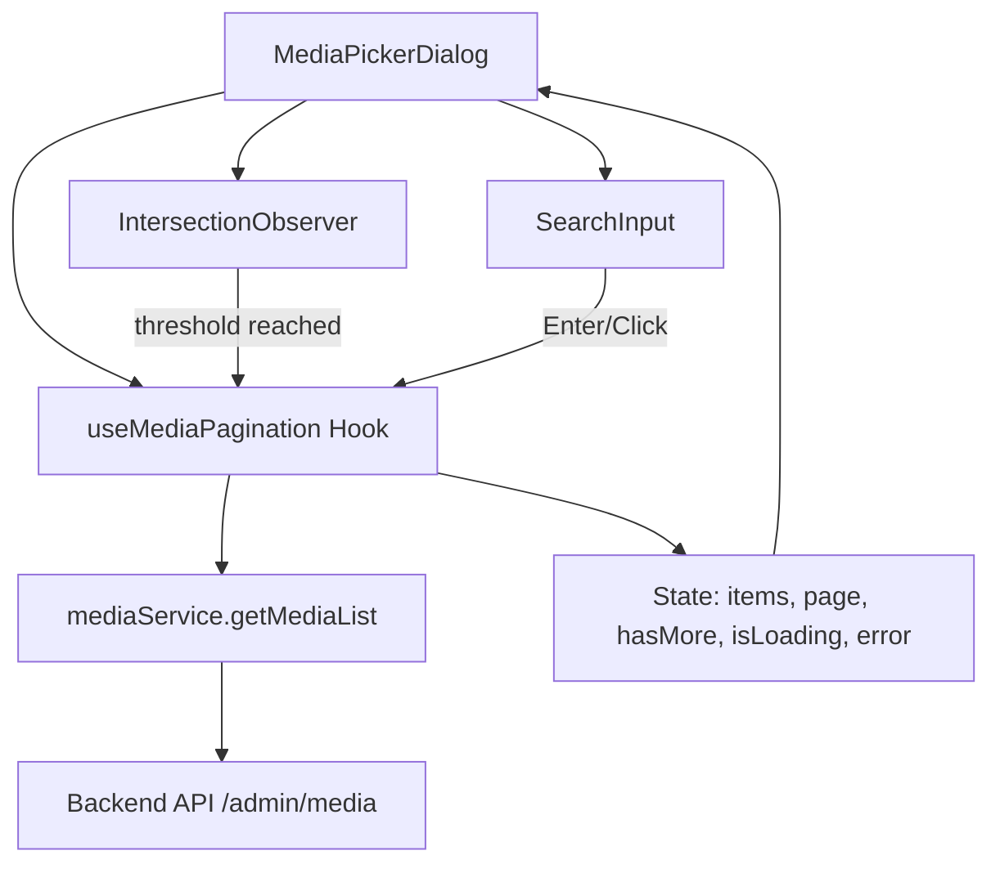
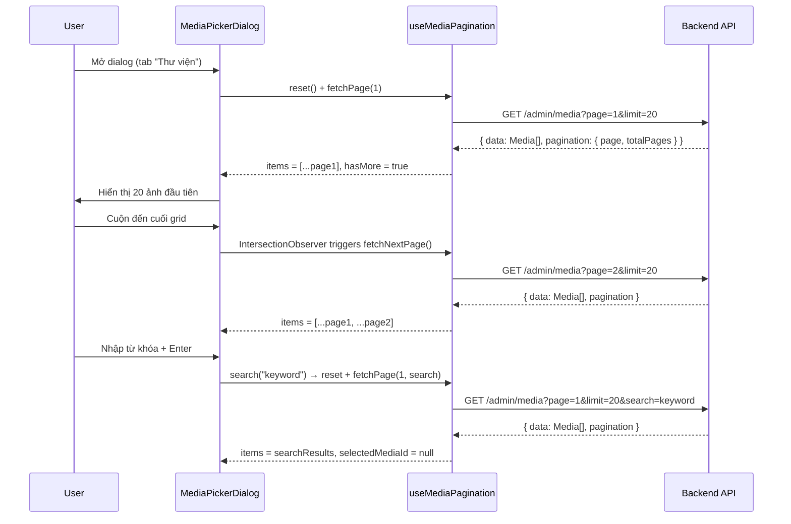

# Design Document: Media Picker Optimization

## Overview

Tối ưu hiệu suất component `MediaPickerDialog` bằng cách thay thế cơ chế tải toàn bộ 80 ảnh cùng lúc bằng infinite scroll với batch size 20 ảnh/trang. Đồng thời cải thiện UX tìm kiếm và tăng chiều cao dialog để hiển thị nhiều ảnh hơn.

### Vấn đề hiện tại

- Component hiện tại fetch `limit: 80` ảnh trong một request duy nhất, gây chậm khi mở dialog
- Không có cơ chế phân trang phía frontend (backend đã hỗ trợ `page`, `limit`, `totalPages`)
- Chiều cao dialog bị giới hạn (`max-h-[90vh]`, grid `max-h-[54vh]`) khiến người dùng phải cuộn nhiều
- Tìm kiếm trigger lại toàn bộ fetch mỗi khi `search` state thay đổi (qua useEffect dependency)

### Giải pháp

Áp dụng **infinite scroll** sử dụng `IntersectionObserver` API, giảm batch size xuống 20, tăng chiều cao dialog, và cải thiện logic tìm kiếm với debounce/explicit trigger.

## Architecture



### Luồng hoạt động chính



## Components and Interfaces

### 1. Custom Hook: `useMediaPagination`

Hook quản lý toàn bộ logic phân trang, tìm kiếm, và trạng thái loading.

```typescript
interface UseMediaPaginationOptions {
  batchSize?: number       // default: 20
  enabled?: boolean        // chỉ fetch khi dialog open
}

interface UseMediaPaginationReturn {
  items: Media[]
  isLoading: boolean       // đang tải trang đầu tiên
  isLoadingMore: boolean   // đang tải trang tiếp theo
  hasMore: boolean         // còn trang tiếp theo không
  error: Error | null
  currentPage: number
  totalPages: number
  
  // Actions
  fetchNextPage: () => void
  search: (query: string) => void
  reset: () => void
  retry: () => void
}
```

### 2. Component: `MediaPickerDialog` (refactored)

Thay đổi chính:
- Sử dụng `useMediaPagination` thay vì `fetchMedia` trực tiếp
- Thêm `IntersectionObserver` sentinel element ở cuối grid
- Tăng chiều cao CSS
- Tách logic search thành explicit trigger (Enter/button click)

### 3. Sentinel Element cho IntersectionObserver

```typescript
interface ScrollSentinelProps {
  onIntersect: () => void
  disabled?: boolean       // disabled khi isLoadingMore hoặc !hasMore
  rootMargin?: string      // default: "200px"
}
```

### 4. Media Service (không thay đổi interface)

Service hiện tại đã hỗ trợ đầy đủ params cần thiết:
```typescript
mediaService.getMediaList({
  page: number,
  limit: number,
  search?: string
})
```

## Data Models

### State Model của `useMediaPagination`

```typescript
interface PaginationState {
  items: Media[]              // Danh sách tích lũy qua các trang
  currentPage: number         // Trang hiện tại đã tải
  totalPages: number          // Tổng số trang từ API response
  isLoading: boolean          // Đang tải trang đầu tiên
  isLoadingMore: boolean      // Đang tải trang tiếp theo
  hasMore: boolean            // currentPage < totalPages
  error: Error | null         // Lỗi của request gần nhất
  searchQuery: string         // Từ khóa tìm kiếm hiện tại
  loadedPages: Set<number>    // Các trang đã tải (tránh duplicate)
  abortController: AbortController | null  // Cancel request khi cần
}
```

### API Response Model (đã có sẵn)

```typescript
// Từ base.schema.ts - PaginationSchema
interface Pagination {
  page: number
  limit: number
  total: number
  totalPages: number
}

// Response structure
interface MediaListResponse {
  EC: number
  EM: string
  DT: {
    data: Media[]
    pagination: Pagination
  }
}
```

### Media Model (đã có sẵn)

```typescript
interface Media {
  id: string
  url: string
  secureUrl?: string | null
  fileName?: string | null
  originalName?: string | null
  mimeType: string
  size?: number | null
  width?: number | null
  height?: number | null
  altText?: string | null
  title?: string | null
  folder?: string | null
  createdAt?: string
  filename: string  // computed: originalName ?? fileName ?? "media-file"
}
```

## Correctness Properties

*Một property là một đặc tính hoặc hành vi phải đúng trong mọi trường hợp thực thi hợp lệ của hệ thống — về cơ bản là một phát biểu hình thức về những gì hệ thống phải làm. Properties đóng vai trò cầu nối giữa đặc tả dễ đọc cho con người và đảm bảo tính đúng đắn có thể kiểm chứng bằng máy.*

### Property 1: Page accumulation preserves existing items

*For any* danh sách media hiện tại và bất kỳ trang mới nào được tải thành công, danh sách sau khi append phải bằng danh sách cũ nối với dữ liệu trang mới, và không có item nào từ danh sách cũ bị mất hoặc thay đổi thứ tự.

**Validates: Requirements 1.4**

### Property 2: Pagination stops at last page

*For any* giá trị `totalPages` trả về từ API, khi `currentPage >= totalPages`, hệ thống phải đặt `hasMore = false` và không gửi thêm bất kỳ request nào cho trang tiếp theo, bất kể số lần scroll event xảy ra.

**Validates: Requirements 1.5**

### Property 3: Error preserves existing data

*For any* danh sách media đã tải trước đó và bất kỳ lỗi nào xảy ra trong quá trình fetch (dù là tải trang tiếp theo hay tìm kiếm), danh sách items hiện tại phải giữ nguyên không thay đổi.

**Validates: Requirements 1.6, 2.7**

### Property 4: Search replaces list entirely

*For any* danh sách media hiện tại và bất kỳ kết quả tìm kiếm mới nào, sau khi search hoàn thành thành công, danh sách hiển thị phải bằng chính xác kết quả tìm kiếm (không chứa items từ danh sách cũ).

**Validates: Requirements 2.3**

### Property 5: Infinite scroll with search maintains search context

*For any* từ khóa tìm kiếm đang active và bất kỳ số trang kết quả nào, mỗi request tải trang tiếp theo phải bao gồm cùng tham số `search` và `page` tăng dần, cho đến khi `page >= totalPages`.

**Validates: Requirements 2.5**

### Property 6: Selection preserved on page append

*For any* `selectedMediaId` hợp lệ (khác null) và bất kỳ trang mới nào được append vào danh sách, giá trị `selectedMediaId` phải giữ nguyên không thay đổi sau khi append.

**Validates: Requirements 4.1**

### Property 7: Search resets selection

*For any* trạng thái selection hiện tại (selectedMediaId khác null) và bất kỳ hành động tìm kiếm mới nào, `selectedMediaId` phải được reset về `null` sau khi search được trigger.

**Validates: Requirements 4.2**

### Property 8: Detail panel displays all required fields

*For any* media item được chọn (có các trường với giá trị bất kỳ), panel chi tiết phải hiển thị đầy đủ: ảnh preview (url), tên file (filename), kích thước (size), định dạng MIME (mimeType), và các input cho alt text và caption.

**Validates: Requirements 4.3**

### Property 9: Orphaned selection is reset

*For any* `selectedMediaId` và bất kỳ danh sách items mới nào mà không chứa item có id bằng `selectedMediaId`, hệ thống phải reset `selectedMediaId` về `null`.

**Validates: Requirements 4.4**

### Property 10: No duplicate or concurrent page requests

*For any* chuỗi scroll events hoặc trigger tải trang, hệ thống không được gửi request cho một trang đã tải trong cùng search context, và không được gửi request mới khi đã có request đang in-flight.

**Validates: Requirements 1.3, 5.2, 5.5**

## Error Handling

### Lỗi tải trang tiếp theo (Infinite Scroll)

| Tình huống | Xử lý |
|---|---|
| Network error / timeout (15s) | Giữ nguyên items đã tải, hiển thị nút "Thử lại" ở cuối grid |
| Nhấn "Thử lại" | Gửi lại request cùng page + limit + search params |
| API trả về EC !== 0 | Coi như lỗi, hiển thị nút "Thử lại" |

### Lỗi tìm kiếm

| Tình huống | Xử lý |
|---|---|
| Search request thất bại | Giữ nguyên danh sách hiện tại, hiển thị toast/thông báo lỗi |
| Search trả về empty | Hiển thị empty state "Không tìm thấy media phù hợp" |

### Lỗi tải trang đầu tiên

| Tình huống | Xử lý |
|---|---|
| Page 1 thất bại | Hiển thị error state với nút "Thử lại" thay vì grid |
| Page 1 trả về empty | Hiển thị empty state "Chưa có media" |

### Request Cancellation

- Khi dialog đóng: cancel mọi request đang in-flight qua `AbortController`
- Khi search mới được trigger: cancel request trang cũ (nếu có), reset state

## Testing Strategy

### Property-Based Tests (fast-check + vitest)

Sử dụng `fast-check` (đã có trong devDependencies) với `vitest` để kiểm chứng các correctness properties.

**Cấu hình:**
- Mỗi property test chạy tối thiểu 100 iterations
- Tag format: `Feature: media-picker-optimization, Property {number}: {property_text}`
- Test file: `components/media/__tests__/media-picker-pagination.property.test.ts`

**Properties cần implement:**
1. Page accumulation (Property 1) — test pure function logic của hook
2. Pagination stop condition (Property 2) — test state machine logic
3. Error data preservation (Property 3) — test reducer/state logic
4. Search replaces list (Property 4) — test state transition
5. Search context in pagination (Property 5) — test request params
6. Selection preservation on append (Property 6) — test state logic
7. Search resets selection (Property 7) — test state transition
8. Detail panel completeness (Property 8) — test render output
9. Orphaned selection reset (Property 9) — test state logic
10. Request deduplication (Property 10) — test guard logic

### Unit Tests (vitest)

**Test file:** `components/media/__tests__/media-picker-dialog.test.tsx`

Các test case cụ thể:
- Dialog mở → fetch page 1 với limit=20
- IntersectionObserver trigger → fetch page tiếp theo
- Empty state hiển thị khi data rỗng
- Loading skeleton hiển thị khi đang fetch page 1
- Loading indicator ở cuối grid khi đang fetch page tiếp
- Nút "Thử lại" hiển thị khi fetch thất bại
- Dialog đóng/mở lại → reset hoàn toàn
- CSS height values đúng theo requirement

### Integration Tests

- Full flow: mở dialog → cuộn → tải thêm → chọn ảnh → chèn
- Search flow: nhập keyword → Enter → kết quả mới → cuộn thêm
- Error recovery: fetch fail → retry → success

### Chiến lược test tổng thể

| Loại test | Mục đích | Số lượng ước tính |
|---|---|---|
| Property tests | Kiểm chứng invariants qua nhiều inputs | 10 properties × 100 iterations |
| Unit tests | Kiểm tra behavior cụ thể | ~15 test cases |
| Integration tests | Kiểm tra full flow | ~5 scenarios |
