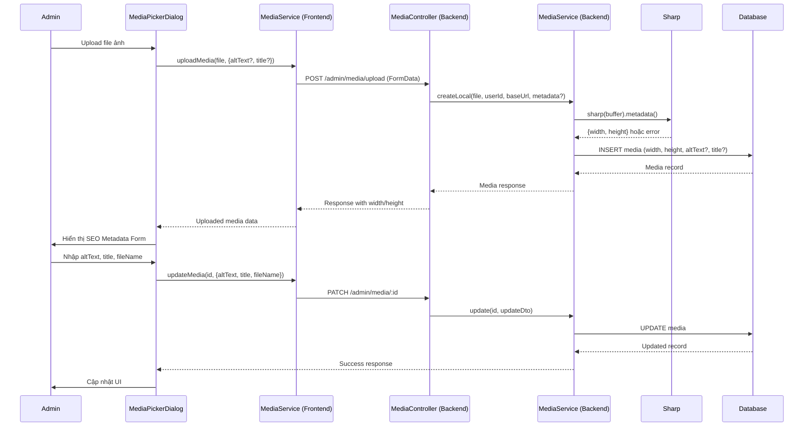
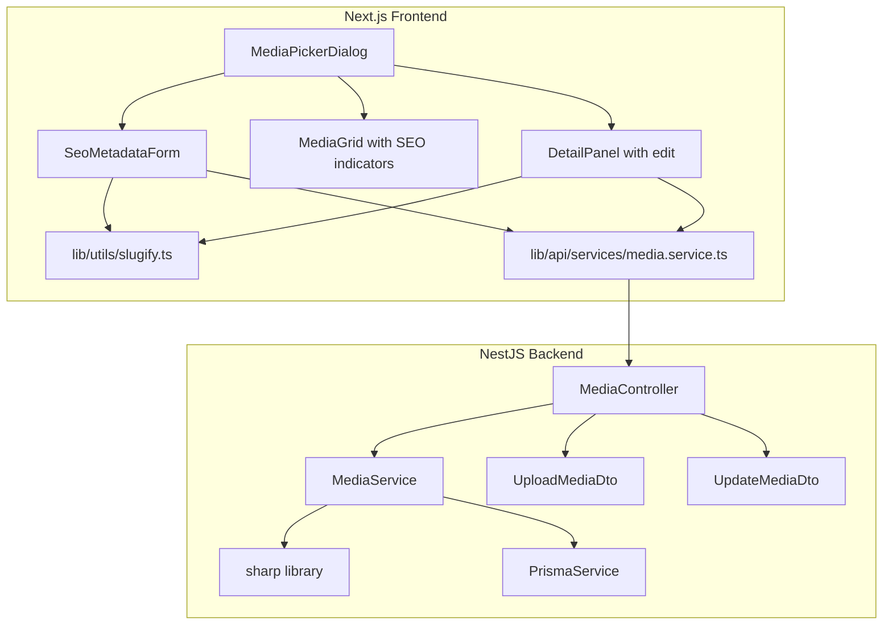

# Design Document: Media Upload SEO Optimization

## Overview

Tài liệu thiết kế kỹ thuật cho tính năng tối ưu SEO media upload trong hệ thống DukyStore Dashboard. Tính năng bao gồm:

1. **Backend**: Tự động trích xuất kích thước ảnh (width/height) khi upload bằng thư viện `sharp`, chấp nhận metadata SEO (altText, title) trong request upload, và validate fileName theo chuẩn slug.
2. **Frontend**: Hiển thị form nhập SEO metadata sau upload, tự động sinh filename dạng slug từ alt text/title (hỗ trợ tiếng Việt), hiển thị trạng thái SEO trong media grid, và cho phép chỉnh sửa metadata cho ảnh đã upload.

### Quyết định thiết kế chính

- Sử dụng `sharp` (thư viện xử lý ảnh hiệu suất cao, dựa trên libvips) để trích xuất metadata thay vì đọc header thủ công — đảm bảo hỗ trợ đa định dạng và xử lý nhanh.
- Tách hàm `slugify` thành utility module riêng (`lib/utils/slugify.ts`) thay vì duplicate trong từng page — tái sử dụng logic đã có trong project.
- SEO form hiển thị inline trong Media Picker Dialog thay vì modal riêng — giảm số bước thao tác cho admin.
- Sử dụng debounce 300ms cho auto-slug generation — cân bằng giữa responsiveness và performance.

## Architecture

### Tổng quan luồng dữ liệu



### Component Architecture



## Components and Interfaces

### Backend Components

#### 1. MediaController - Upload endpoint mở rộng

```typescript
// src/modules/media/media.controller.ts
@Post('upload')
@UseInterceptors(FileInterceptor('file'))
@ApiConsumes('multipart/form-data')
upload(
  @UploadedFile(imageUploadPipe) file: UploadedMediaFile,
  @Body() uploadMetadataDto: UploadMediaMetadataDto, // MỚI
  @CurrentUser() user: AuthUser,
  @Req() request: Request,
) {
  return this.mediaService.createLocal(
    file,
    user.id,
    this.getBaseUrl(request),
    uploadMetadataDto, // Truyền metadata vào service
  );
}
```

#### 2. UploadMediaMetadataDto (MỚI)

```typescript
// src/modules/media/dto/upload-media-metadata.dto.ts
import { ApiPropertyOptional } from '@nestjs/swagger';
import { IsOptional, IsString, MaxLength, MinLength, Matches } from 'class-validator';

export class UploadMediaMetadataDto {
  @ApiPropertyOptional({ example: 'Áo blazer nữ màu đen' })
  @IsOptional()
  @IsString()
  @MinLength(1)
  @MaxLength(500)
  @Matches(/^[^<>]*$/, { message: 'altText must not contain HTML tags' })
  altText?: string;

  @ApiPropertyOptional({ example: 'Áo blazer nữ 2026' })
  @IsOptional()
  @IsString()
  @MinLength(1)
  @MaxLength(500)
  @Matches(/^[^<>]*$/, { message: 'title must not contain HTML tags' })
  title?: string;
}
```

#### 3. MediaService - createLocal mở rộng

```typescript
// Thêm vào media.service.ts
import sharp from 'sharp';

interface ImageDimensions {
  width: number | null;
  height: number | null;
}

async createLocal(
  file: UploadedMediaFile,
  uploadedById: string,
  baseUrl: string,
  metadata?: UploadMediaMetadataDto,
) {
  this.assertUploadFile(file);
  await mkdir(LOCAL_MEDIA_FOLDER, { recursive: true });

  const extension = this.resolveUploadExtension(file);
  const storedFileName = `${randomUUID()}${extension}`;
  const filePath = join(LOCAL_MEDIA_FOLDER, storedFileName);

  await writeFile(filePath, file.buffer);

  // Trích xuất kích thước ảnh
  const dimensions = await this.extractDimensions(file.buffer);

  const url = `${baseUrl}/api/v1/media/files/${storedFileName}`;
  const media = await this.prisma.media.create({
    data: {
      provider: MediaProvider.LOCAL,
      uploadedById,
      url,
      secureUrl: url,
      providerKey: storedFileName,
      fileName: storedFileName,
      originalName: file.originalname,
      mimeType: file.mimetype,
      size: file.size,
      width: dimensions.width,
      height: dimensions.height,
      folder: 'uploads',
      altText: metadata?.altText?.trim() || null,
      title: metadata?.title?.trim() || null,
    },
    include: this.mediaInclude(),
  });

  return this.toMedia(media);
}

private async extractDimensions(buffer: Buffer): Promise<ImageDimensions> {
  try {
    const metadata = await Promise.race([
      sharp(buffer).metadata(),
      new Promise<never>((_, reject) =>
        setTimeout(() => reject(new Error('Timeout')), 5000),
      ),
    ]);

    const width = metadata.width;
    const height = metadata.height;

    if (
      width && height &&
      Number.isInteger(width) && Number.isInteger(height) &&
      width >= 1 && width <= 65535 &&
      height >= 1 && height <= 65535
    ) {
      return { width, height };
    }

    return { width: null, height: null };
  } catch {
    // SVG, corrupt files, timeout → graceful fallback
    return { width: null, height: null };
  }
}
```

#### 4. UpdateMediaDto - Thêm validation cho fileName

```typescript
// Cập nhật validation trong normalizeUpdateInput
private validateFileName(fileName: string): void {
  // Slug part + extension, max 200 chars total
  const fileNameRegex = /^[a-z0-9]+(-[a-z0-9]+)*\.[a-z]{2,10}$/;
  if (!fileNameRegex.test(fileName) || fileName.length > 200) {
    throw new BadRequestException(
      'fileName must be a valid slug with extension (max 200 chars)',
    );
  }
}
```

### Frontend Components

#### 1. `lib/utils/slugify.ts` (MỚI - utility module)

```typescript
/**
 * Chuyển đổi chuỗi bất kỳ (bao gồm tiếng Việt có dấu) thành URL slug.
 * Quy tắc:
 * - Chuyển tiếng Việt có dấu thành không dấu
 * - Chuyển toàn bộ thành chữ thường
 * - Loại bỏ ký tự không phải a-z, 0-9, khoảng trắng, gạch ngang
 * - Thay khoảng trắng bằng gạch ngang đơn
 * - Gộp nhiều gạch ngang liên tiếp thành một
 * - Loại bỏ gạch ngang đầu/cuối
 */
export function slugify(value: string): string {
  return value
    .normalize('NFD')
    .replace(/[\u0300-\u036f]/g, '')
    .replace(/đ/g, 'd')
    .replace(/Đ/g, 'd')
    .toLowerCase()
    .replace(/[^a-z0-9\s-]/g, '')
    .replace(/[\s]+/g, '-')
    .replace(/-{2,}/g, '-')
    .replace(/^-+|-+$/g, '');
}

/**
 * Sinh SEO filename từ text, giữ nguyên extension gốc.
 * Giới hạn phần slug tối đa maxLength ký tự, cắt tại ranh giới từ.
 */
export function generateSeoFilename(
  text: string,
  originalExtension: string,
  maxLength: number = 100,
): string {
  let slug = slugify(text);

  if (slug.length > maxLength) {
    // Cắt tại ranh giới từ (dấu gạch ngang) gần nhất
    const truncated = slug.substring(0, maxLength);
    const lastHyphen = truncated.lastIndexOf('-');
    slug = lastHyphen > 0 ? truncated.substring(0, lastHyphen) : truncated;
  }

  if (!slug) {
    return `media${originalExtension}`;
  }

  return `${slug}${originalExtension}`;
}
```

#### 2. `components/media/seo-metadata-form.tsx` (MỚI)

```typescript
interface SeoMetadataFormProps {
  originalExtension: string;
  initialAltText?: string;
  initialTitle?: string;
  initialFileName?: string;
  onSave: (data: SeoMetadataPayload) => Promise<void>;
  isSaving: boolean;
}

interface SeoMetadataPayload {
  altText: string;
  title: string;
  fileName: string;
}
```

Component bao gồm:
- Input `altText` (required, maxLength=125, label "Mô tả nội dung ảnh")
- Input `title` (optional, maxLength=200)
- Input `seoFilename` (auto-generated, editable, hiển thị preview với extension)
- Nút "Lưu thông tin SEO"
- Logic debounce 300ms cho auto-slug generation
- State `isManuallyEdited` để track khi admin chỉnh sửa thủ công filename

#### 3. `lib/api/services/media.service.ts` - Thêm updateMedia

```typescript
async updateMedia(id: string, data: { altText?: string; title?: string; fileName?: string }) {
  const response = await apiClient.patch(`/admin/media/${id}`, data);
  return MediaDetailResponseSchema.parse(response).DT;
}
```

#### 4. MediaPickerDialog - Cập nhật

Thay đổi chính:
- Sau upload thành công → hiển thị `SeoMetadataForm` thay vì chuyển thẳng về library
- Trong media grid → thêm icon cảnh báo cho ảnh thiếu altText
- Trong detail panel → thêm các trường editable cho altText, title, fileName với nút "Cập nhật"

## Data Models

### Database Schema (không thay đổi)

Prisma Media model đã có sẵn các trường cần thiết:

```prisma
model Media {
  id           String        @id @default(cuid())
  provider     MediaProvider @default(LOCAL)
  url          String
  fileName     String        // Sẽ lưu SEO filename khi được cập nhật
  originalName String?       // Giữ nguyên tên file gốc
  mimeType     String
  size         Int?
  width        Int?          // Sẽ được populate bởi sharp
  height       Int?          // Sẽ được populate bởi sharp
  altText      String?       // SEO alt text
  title        String?       // SEO title
  metadata     Json?
  // ... other fields
}
```

### API Request/Response Models

#### POST /admin/media/upload (cập nhật)

**Request** (multipart/form-data):
```
file: File (required)
altText: string (optional, 1-500 chars, plain text)
title: string (optional, 1-500 chars, plain text)
```

**Response**:
```json
{
  "EC": 0,
  "EM": "Success",
  "DT": {
    "id": "clxyz...",
    "url": "http://localhost:3001/api/v1/media/files/uuid.jpg",
    "fileName": "uuid.jpg",
    "originalName": "photo.jpg",
    "mimeType": "image/jpeg",
    "size": 245000,
    "width": 1200,
    "height": 800,
    "altText": "Áo blazer nữ màu đen",
    "title": "Áo blazer nữ 2026",
    "createdAt": "2025-01-15T10:00:00Z"
  }
}
```

#### PATCH /admin/media/:id (đã có, thêm validation)

**Request**:
```json
{
  "altText": "Áo blazer nữ màu đen",
  "title": "Áo blazer nữ 2026",
  "fileName": "ao-blazer-nu-2026.jpg"
}
```

**Validation rules cho fileName**:
- Pattern: `^[a-z0-9]+(-[a-z0-9]+)*\.[a-z]{2,10}$`
- Max length: 200 ký tự (bao gồm extension)

### Frontend State Model

```typescript
// State cho SeoMetadataForm
interface SeoFormState {
  altText: string;
  title: string;
  seoFilename: string;        // Phần slug (không bao gồm extension)
  originalExtension: string;  // .jpg, .png, etc.
  isManuallyEdited: boolean;  // Track nếu admin đã chỉnh sửa thủ công filename
  validationErrors: {
    altText?: string;
    title?: string;
    seoFilename?: string;
  };
}
```

## Correctness Properties

*A property is a characteristic or behavior that should hold true across all valid executions of a system — essentially, a formal statement about what the system should do. Properties serve as the bridge between human-readable specifications and machine-verifiable correctness guarantees.*

### Property 1: Image dimension extraction accuracy

*For any* valid image buffer in JPEG, PNG, WebP, GIF, or AVIF format with known pixel dimensions (width W, height H where 1 ≤ W,H ≤ 65535), the `extractDimensions` function SHALL return `{ width: W, height: H }` matching the actual pixel dimensions exactly.

**Validates: Requirements 1.1, 1.2**

### Property 2: Slugify output invariants

*For any* input string (including Vietnamese diacritics, special characters, mixed case, and Unicode), the `slugify` function SHALL produce output that satisfies ALL of the following invariants simultaneously:
- Contains only lowercase letters (a-z), digits (0-9), and hyphens (-)
- Does not start or end with a hyphen
- Does not contain consecutive hyphens
- Contains no Vietnamese diacritical marks
- Is entirely lowercase

**Validates: Requirements 2.4, 3.1, 3.3, 3.4**

### Property 3: SEO filename extension preservation

*For any* original filename with a valid extension (e.g., .jpg, .png, .webp) and any non-empty alt text or title input, the `generateSeoFilename` function SHALL produce output that ends with the exact same extension as the original file.

**Validates: Requirements 3.6**

### Property 4: Slug truncation at word boundary

*For any* input string that produces a slug longer than 100 characters, the `generateSeoFilename` function SHALL produce a slug portion (excluding extension) that is at most 100 characters long AND is truncated at a hyphen boundary (the last character before truncation point is not a partial word).

**Validates: Requirements 3.7**

### Property 5: fileName validation correctness

*For any* string input to the fileName validator:
- If the string matches the pattern `[a-z0-9]+(-[a-z0-9]+)*\.[a-z]{2,10}` AND total length ≤ 200, validation SHALL pass
- If the string contains uppercase letters, spaces, special characters (other than hyphen and dot), consecutive hyphens, or exceeds 200 characters, validation SHALL reject with an appropriate error

**Validates: Requirements 4.4, 4.5**

### Property 6: Text field validation (altText/title)

*For any* string input to the altText or title validator during upload:
- If the string length is between 1 and 500 characters AND contains no HTML tags (`<` or `>` characters), validation SHALL pass
- If the string is empty, exceeds 500 characters, or contains HTML tag characters, validation SHALL reject

**Validates: Requirements 4.6, 5.4, 5.5**

## Error Handling

### Backend Error Handling

| Tình huống | Hành vi | HTTP Status |
|---|---|---|
| File không phải ảnh | Reject upload, trả lỗi "Unsupported image MIME type" | 400 |
| File vượt quá 10MB | Reject upload, trả lỗi "Uploaded file exceeds 10MB limit" | 400 |
| Sharp không đọc được metadata (SVG, corrupt) | Lưu width/height = null, upload thành công | 200 |
| Sharp timeout (> 5s) | Lưu width/height = null, upload thành công | 200 |
| altText/title chứa HTML tags | Reject request, trả lỗi validation | 400 |
| altText/title vượt quá 500 ký tự | Reject request, trả lỗi validation | 400 |
| fileName không hợp lệ (PATCH) | Reject request, trả lỗi "fileName must be a valid slug with extension" | 400 |
| fileName vượt quá 200 ký tự (PATCH) | Reject request, trả lỗi validation | 400 |
| Media ID không tồn tại (PATCH) | Trả lỗi "Media not found" | 404 |

### Frontend Error Handling

| Tình huống | Hành vi |
|---|---|
| Upload thất bại (network) | Hiển thị toast error, cho phép retry |
| PATCH thất bại (network) | Hiển thị error message inline, giữ form data, enable nút lưu |
| PATCH thất bại (validation) | Hiển thị lỗi cụ thể từ server dưới trường tương ứng |
| Alt text trống khi submit | Hiển thị warning inline "Alt text là bắt buộc cho SEO" |
| Slugify tạo chuỗi rỗng | Fallback về "media" + extension |

## Testing Strategy

### Property-Based Tests (PBT)

Sử dụng thư viện **fast-check** cho TypeScript property-based testing.

Mỗi property test chạy tối thiểu **100 iterations** với input ngẫu nhiên.

#### Backend PBT (NestJS + Jest + fast-check)

1. **Property 1**: Test `extractDimensions` với ảnh buffer ngẫu nhiên (tạo bằng sharp)
   - Tag: `Feature: media-upload-seo-optimization, Property 1: Image dimension extraction accuracy`

2. **Property 5**: Test fileName validation với chuỗi ngẫu nhiên
   - Tag: `Feature: media-upload-seo-optimization, Property 5: fileName validation correctness`

3. **Property 6**: Test altText/title validation với chuỗi ngẫu nhiên
   - Tag: `Feature: media-upload-seo-optimization, Property 6: Text field validation`

#### Frontend PBT (Vitest + fast-check)

1. **Property 2**: Test `slugify()` với chuỗi ngẫu nhiên (bao gồm Unicode, Vietnamese)
   - Tag: `Feature: media-upload-seo-optimization, Property 2: Slugify output invariants`

2. **Property 3**: Test `generateSeoFilename()` bảo toàn extension
   - Tag: `Feature: media-upload-seo-optimization, Property 3: SEO filename extension preservation`

3. **Property 4**: Test `generateSeoFilename()` truncation tại word boundary
   - Tag: `Feature: media-upload-seo-optimization, Property 4: Slug truncation at word boundary`

### Unit Tests (Example-Based)

#### Backend
- Upload với altText/title → verify lưu vào DB
- Upload không có altText/title → verify null
- Upload SVG → verify width/height = null, upload thành công
- PATCH với fileName hợp lệ → verify cập nhật
- PATCH với fileName chứa uppercase → verify reject

#### Frontend
- Render SeoMetadataForm sau upload → verify 3 trường hiển thị
- Nhập altText → verify auto-slug generation
- Chỉnh sửa thủ công filename → verify auto-generation dừng
- Xóa toàn bộ filename → verify auto-generation resume
- Submit form trống altText → verify warning hiển thị
- Media grid item thiếu altText → verify warning icon hiển thị
- Detail panel hiển thị SEO info khi chọn ảnh
- Nút lưu disabled khi đang saving

### Integration Tests

- Upload file → verify response chứa width/height
- Upload file với metadata → PATCH update → verify round-trip
- Full flow: upload → nhập SEO → lưu → verify trong library
